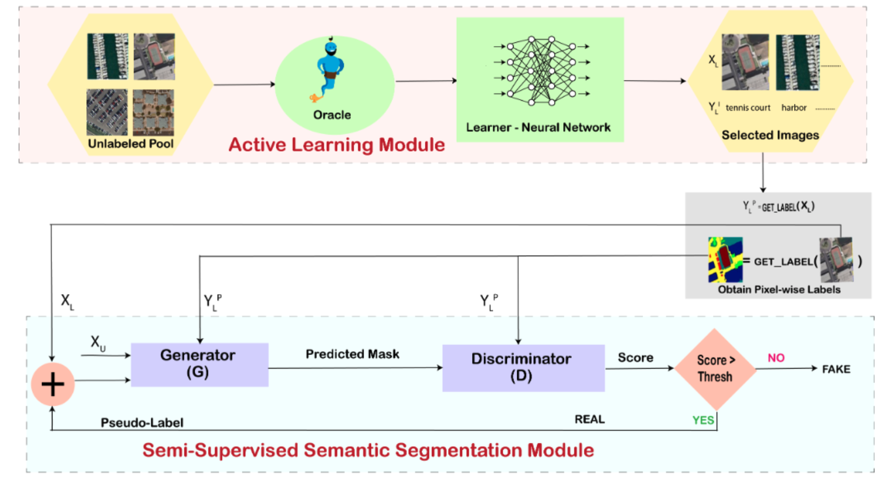

# ALS4GAN
This repository contains code for the paper: [Active Learning for Improved Semi Supervised Semantic Segmentation in Satellite Images](https://sites.google.com/view/al-s4gan-semi-sup-sseg/home) which has been accepted at WACV 2022.

### Abstract
Remote sensing data is crucial for applications ranging from monitoring forest fires and deforestation to tracking urbanization. Most of these tasks require dense pixel-level annotations for the model to parse visual information from limited labeled data available for these satellite images. Due to the dearth of high-quality labeled training data in this domain, recent advances have focused on semi-supervised techniques. These techniques generate pseudo-labels from a small set of labeled examples which are used to augment the labeled training set. This makes it necessary to have a highly representative and diverse labeled training set. Therefore, we propose to use an active learning-based sampling strategy to select a highly representative set of labeled training data. We demonstrate our proposed method's effectiveness on two existing semantic segmentation datasets containing satellite images: UC Merced Land Use Classification Dataset, and DeepGlobe Land Cover Classification Dataset. We report a 27% improvement in mIoU with as little as 2% labeled data using active learning sampling strategies over randomly sampling the small set of labeled training data.



## Pre-requisites
Create a conda enviroment using the provided requirements.yaml file

`conda env create --file=requirements.yaml` 

## Data Peparation

### UC Merced Land Use Classification Dataset

- Download the images and classification labels for the UC Merced Land Use Classification Dataset [here](http://weegee.vision.ucmerced.edu/datasets/landuse.html)
- Download the semantic segmentation labels for the UC Merced Land Use Classification Dataset (DLSRD Dataset) [here](https://sites.google.com/view/zhouwx/dataset#h.p_hQS2jYeaFpV0)

### DeepGlobe Land Cover Classification Dataset

- Download the images and semantic segmentation labels for the DeepGlobe Land Cover Classification Dataset [here](http://deepglobe.org/)
- Download the JSON file with the image classification labels for the DeepGlobe Land Cover Classification Dataset [here](https://drive.google.com/file/d/1yRN8fbr2X4CU_W9hzGCM9lTSqD_2kVNK/view?usp=sharing)

## Training and Testing

**Training the Active Learner**  

  ```
  python tools/train_AL.py --dataset-name <DATASET_NAME>   
                           --query-strategy <QUERY_STRATEGY> 
                           --random-scale 
                           --random-mirror 
                           --data-dir <DATA_DIR>
                           --data-list <DATA_LIST> 
                           --labeled-ratio <LABELED_RATIO>
                           --model-name <MODEL_NAME>
                           --num-classes <NUM_CLASSES>
                           --learning-rate 0.001 
                           --num-epochs 50 
                           --alpha <ALPHA>
                           --beta <BETA>
```

Here is an explanation of the important parameters:
- `dataset-name`: Can be one of `UCM` or `deepglobe` or a custom dataset
- `query-strategy`: Should be one of `entropy` or `margin`
- `data-dir`: Parent directory of the dataset
- `data-list`: Path to the text file containing the file names of the training dataset
- `labeled-ratio`: Labeled ratio (value between 0 and 1, Eg: 0.05 = 5% labeled ratio)
-  `model-name`: Image classification network (Can be one of `res50` or `res101` or another image classification network)
-  `num-classes`: Number of classes in the image classification network
-  `alpha`: A value between 0 and 1 (refer the paper for details)
-  `beta`: A value between 0 and 1 (refer the paper for details)

Training the active learner would output a `.npy` with the image names of the top-k most diverse samples selected by the query strategy. 

  
**Training the S4GAN Model**  
```
python tools/train_s4gan.py --dataset <DATASET_NAME> 
                            --labeled-ratio <LABELED_RATIO>
                            --threshold-st <SELF_TRAINING_THRESHOLD>
                            --num-classes <NUM_CLASSES>
                            --data-dir <DATA_DIR>
                            --data-list <TRAIN_DATA_LIST>
                            --batch-size 10 
                            --num-steps 20000 
                            --restore-from <PRETRAINED_BACKBONE_WEIGHTS_PATH> 
                            --save-pred-every 100 
                            --random-seed <RANDOM_SEED> 
                            --active-learning 
                            --active-learning-images-array <OUTPUT OF train_al.py>
```

Here is an explanation of the important paramters:
- `dataset`: Can be `ucm`or `deepglobe` or a custom dataset
- `labeled-ratio`: Labeled ratio (value between 0 and 1, Eg: 0.05 = 5% labeled ratio)
- `threshold-st`: Self-training theshold between 0 and 1
- `num-classes`: Number of classes for semantic segmentation
- `data-dir`: Parent directory of the dataset
- `data-list`: Path to the text file containing the file names of the training dataset 
- `num-steps`: Number of epochs 
- `restore-from`: ImageNet pretrained weights that were used to initialize the `resnet101` backbone of the `DeepLab` generator. Download ImageNet pretrained Resnet-101([Link](https://download.pytorch.org/models/resnet101-5d3b4d8f.pth)) and place it `./pretrained_models/`
- `random-seed`: Random seed for baseline
- `--active-learning`: Set flag to train s4gan with the output of the active learner. Do not set this flag when training the baseline model. (Refer to the paper for more details)
- `--active-learning-images-array`: Image array outputted by the active learner

**Evaluating the S4GAN Model**  
```
python tools/auto_evaluate.py --start-eval 100 
                              --end-eval 20000 
                              --step-eval 100 
                              --dataset <DATASET_NAME>
                              --data-dir <DATA_DIR>
                              --data-list <TEST_DATA_LIST>
                              --num-classes <NUM_CLASSES>
                              --checkpoint-dir <CHECKPOINT_DIR>
                              --input-size '320,320'
```

This script runs evaluation on all the weights saved during the training of s4gan and finds the epoch at which the model performs the best. 
Here is an explanation of the important paramters:
- `start-eval`: Epoch to start evaluating
- `end-eval`: Epoch to end evaluating
- `num-classes`: Number of classes for semantic segmentation
- `data-dir`: Parent directory of the dataset
- `data-list`: Path to the text file containing the file names of the test dataset 
- `checkpoint-dir`: Directory where the model checkpoints are stored


## Acknowledgements

Parts of the code have been adapted from:
- [semisup-semseg](https://github.com/sud0301/semisup-semseg)
- [deeplab-pytorch](https://github.com/kazuto1011/deeplab-pytorch)
- [modAL](https://github.com/modAL-python/modAL)

## Citation

```
@inproceedings{desai2022active,
  title={Active Learning for Improved Semi-Supervised Semantic Segmentation in Satellite Images},
  author={Desai, Shasvat and Ghose, Debasmita},
  booktitle={Proceedings of the IEEE/CVF Winter Conference on Applications of Computer Vision},
  pages={553--563},
  year={2022}
}
```
